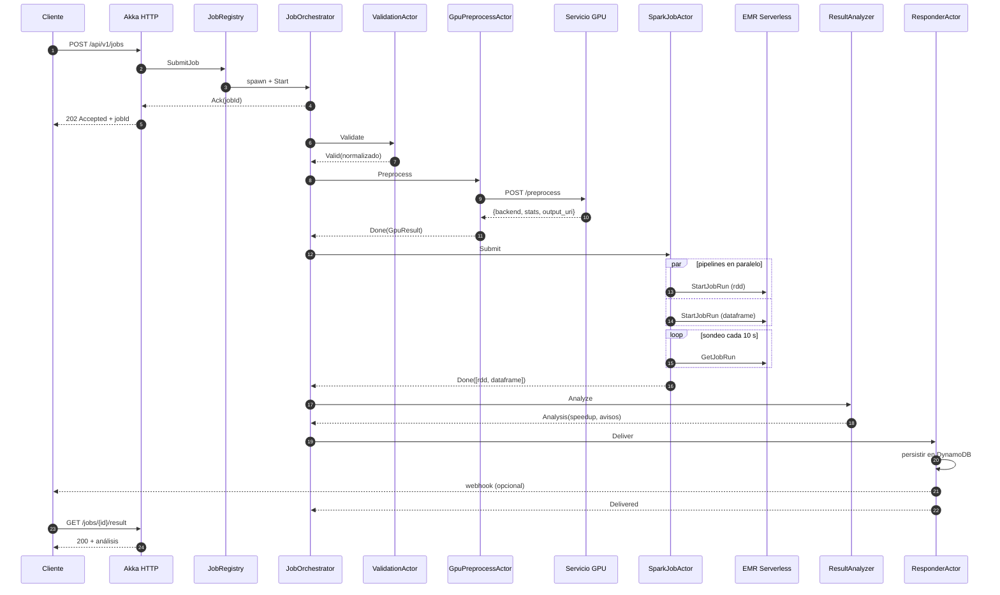
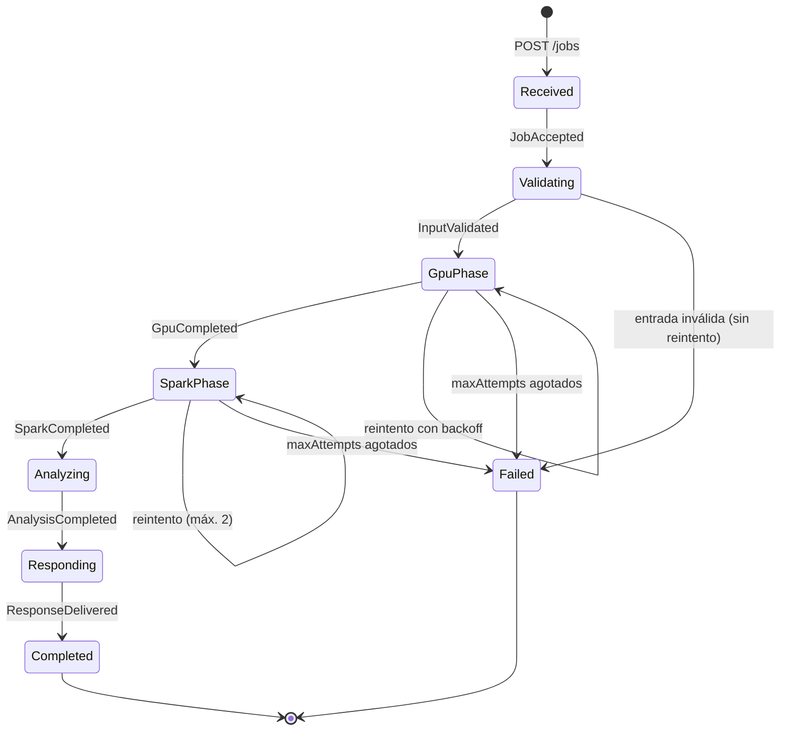
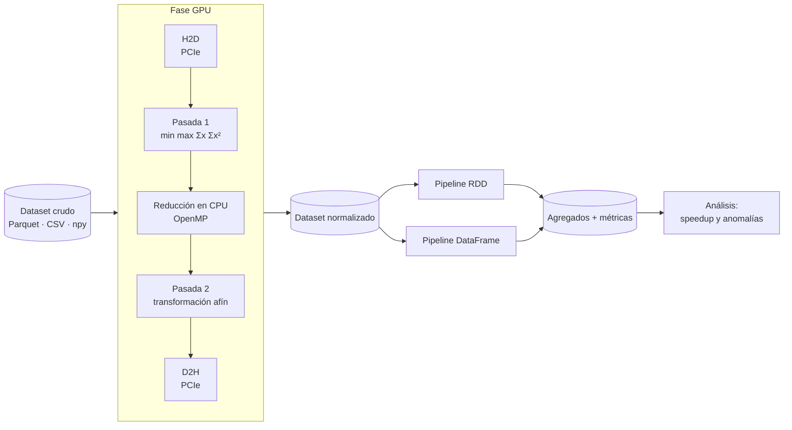
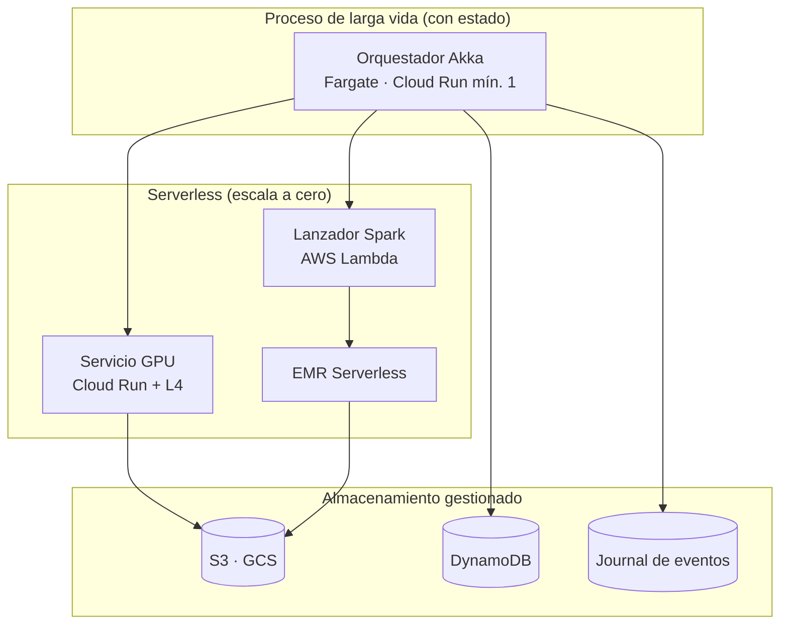

# Diagramas de arquitectura

Complementa `informe/INFORME.md §2`. Los diagramas están en Mermaid: se renderizan
directamente en GitHub y en la mayoría de editores Markdown.

## 1. Secuencia de una petición completa

## 2. Máquina de estados del job

## 3. Camino de los datos

## 4. Dónde se ejecuta cada cosa

