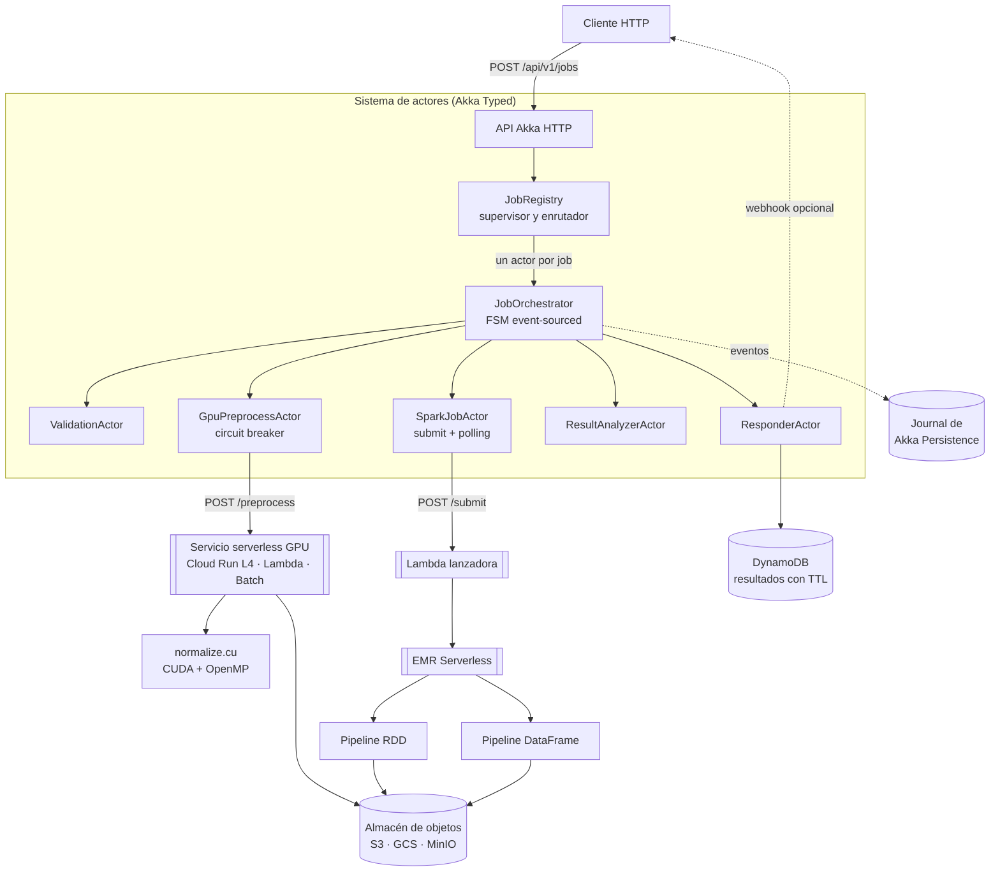

# Informe técnico
## Aplicación híbrida de procesamiento Big-Data en entorno serverless

**Asignatura:** Computación paralela y distribuida · **Versión:** 1.0

---

### Índice

1. [Resumen ejecutivo](#1-resumen-ejecutivo)
2. [Arquitectura](#2-arquitectura)
3. [Módulo 1 — Preprocesamiento en GPU](#3-módulo-1--preprocesamiento-en-gpu)
4. [Módulo 2 — Spark: RDD frente a DataFrame](#4-módulo-2--spark-rdd-frente-a-dataframe)
5. [Módulo 3 — Modelo de actores](#5-módulo-3--modelo-de-actores)
6. [Módulo 4 — Entorno serverless](#6-módulo-4--entorno-serverless)
7. [Análisis de rendimiento](#7-análisis-de-rendimiento)
8. [Conclusiones](#8-conclusiones)
9. [Limitaciones y trabajo futuro](#9-limitaciones-y-trabajo-futuro)
10. [Referencias](#10-referencias)

---

## 1. Resumen ejecutivo

Se ha construido un sistema que procesa un dataset de telemetría en cuatro fases
encadenadas: normalización numérica acelerada por GPU, análisis distribuido con Spark
por dos vías alternativas (RDD y DataFrame), orquestación mediante modelo de actores y
exposición como API HTTP sobre infraestructura serverless.

El sistema funciona, pero el resultado más interesante del trabajo **no** es que
funcione, sino tres hallazgos que contradicen la intuición de partida:

1. **La GPU puede perder contra la CPU en esta tarea.** La normalización es una
   operación limitada por ancho de banda de memoria con muy poca aritmética por byte.
   Cuando los datos hay que enviarlos por PCIe y traerlos de vuelta, el trasiego cuesta
   varias veces más que el cálculo. El kernel es ~25× más rápido que un hilo de CPU,
   pero el proceso completo puede quedar por debajo de una CPU multinúcleo bien
   aprovechada (§3.5, §7.1). La GPU sólo compensa si los datos ya residen en ella o si
   se encadenan varias operaciones sin traerlos de vuelta.

2. **"GPU serverless" no existe en AWS Lambda.** Fue necesario rediseñar esa parte:
   Google Cloud Run con NVIDIA L4 (o Azure Container Apps) sí cumple lo pedido; en AWS
   hay que delegar en AWS Batch. Se implementaron los tres caminos (§6.2).

3. **La ventaja de DataFrame sobre RDD en PySpark viene más de la serialización que de
   Catalyst.** Cada fila que cruza la frontera JVM↔Python se serializa con pickle; el
   camino DataFrame no cruza esa frontera en absoluto. Este factor domina sobre las
   optimizaciones del planificador (§4.2).

---

## 2. Arquitectura

### 2.1 Vista general



### 2.2 Flujo de una petición

| # | Etapa | Actor | Qué ocurre | Fallo → |
|---|---|---|---|---|
| 1 | Validación | `ValidationActor` | Esquema de URI, modo, pipeline, callback | Fallo definitivo, **sin reintento** |
| 2 | GPU | `GpuPreprocessActor` | POST al servicio; normaliza y deja el resultado en el almacén | Reintento con backoff; circuit breaker |
| 3 | Spark | `SparkJobActor` | Lanza RDD y DataFrame **en paralelo**, sondea hasta terminación | Reintento (máx. 2: relanzar es caro) |
| 4 | Análisis | `ResultAnalyzerActor` | Speedup, tasa de anomalías, avisos | Reintento |
| 5 | Respuesta | `ResponderActor` | Persiste y notifica el webhook | Se persiste **siempre**, aunque el webhook falle |

La API es asíncrona en dos tiempos: `POST` devuelve `202 Accepted` inmediatamente y el
cliente sondea `GET /jobs/{id}/result` (que responde `409` + `Retry-After` mientras no
esté listo) o recibe un webhook. Una API síncrona sería inviable: el trabajo dura
minutos y ningún balanceador mantiene esa conexión abierta.

### 2.3 Decisiones de diseño y sus alternativas

| Decisión | Alternativa descartada | Motivo |
|---|---|---|
| Actores para orquestar | AWS Step Functions | Step Functions es excelente para máquinas de estados sencillas, pero el enunciado pide modelo de actores; además, con actores el estado del job y sus reintentos están en el mismo lugar y son testeables sin nube |
| Un actor por job | Un actor por etapa con estado compartido | Aislamiento de fallos: un job corrupto no puede afectar a los demás; nada de locks |
| Event sourcing en el orquestador | Guardar sólo el estado actual | Permite retomar un job desde la etapa alcanzada tras una caída, sin repetir minutos de GPU facturada |
| Dos pasadas en el kernel | Una pasada con estadísticos aproximados | La normalización necesita min/max/media globales; una pasada exigiría un algoritmo online (Welford) que complica sin ganar: sigue siendo limitado por memoria |
| Parquet como formato intermedio | CSV | Columnar y comprimido: permite *column pruning* y *predicate pushdown*, precisamente lo que se quiere medir en §4 |
| Desactivar AQE en el benchmark | Dejarlo activo | AQE sólo actúa en el camino DataFrame; con él activo se compararía "DataFrame + AQE" contra "RDD sin AQE" y el speedup estaría inflado |

---

## 3. Módulo 1 — Preprocesamiento en GPU

### 3.1 El problema

Normalizar un vector de *n* valores en coma flotante:

$$x'_i = \frac{x_i - \mu}{\sigma} \quad\text{(z-score)}\qquad
  x'_i = \frac{x_i - \min}{\max - \min} \quad\text{(min-max)}$$

Es una operación **global**: los parámetros dependen de todo el vector, así que hace
falta recorrerlo entero antes de poder transformar ningún elemento.

### 3.2 Algoritmo: dos pasadas

**Pasada 1 — reducción.** Cada bloque recorre su porción con un *grid-stride loop* y
acumula (min, max, Σx, Σx²) en registros; después se reduce dentro del warp con
`__shfl_down_sync` (sin memoria compartida ni `__syncthreads` a nivel de warp) y entre
warps con memoria compartida. Cada bloque escribe un parcial.

**Reducción final en CPU.** Los ~1024 parciales se reducen en el host con OpenMP. Se
evitan así los atómicos en `double` sobre memoria global, que además de costosos
producen resultados no deterministas entre ejecuciones (el orden de suma en coma
flotante cambia el último bit).

**Pasada 2 — transformación.** Los tres modos se reducen a una única operación afín
`out = (x − shift) · scale`, calculando `(shift, scale)` en el host. Un solo kernel sin
ramas, sin divergencia de warp.

**Estabilidad numérica.** Las acumulaciones se hacen en `double` aunque los datos sean
`float`. Con n = 10⁸ y `float`, Σx² pierde precisión por cancelación catastrófica: el
error relativo en σ puede superar el 1 %. El coste de usar `double` es nulo aquí porque
el kernel está limitado por memoria, no por aritmética.

### 3.3 El papel de OpenMP

OpenMP no es decorativo; hace tres trabajos distintos:

1. **Despacho multi-stream**: cada hilo anfitrión gestiona un stream CUDA y copia su
   *chunk*, solapando transferencias con cómputo.
2. **Reducción de parciales** en el host, con `reduction(min:)`, `reduction(max:)` y
   `reduction(+:)`.
3. **Implementación de referencia en CPU** (`normalize_cpu.cpp`), que cumple tres
   funciones: baseline honesto del speedup, validación numérica del kernel y *fallback*
   cuando el entorno serverless no expone GPU.

### 3.4 Modelo de rendimiento

La intensidad aritmética es de ~3 operaciones por cada 4 bytes leídos: **≈ 0,75 FLOP/byte**.
En el modelo *roofline* de cualquier GPU moderna (punto de codo en 40–80 FLOP/byte) esto
está muy a la izquierda: la operación está **limitada por ancho de banda de memoria**, no
por capacidad de cálculo. Ninguna optimización aritmética ayudará; sólo importa mover bytes.

Tráfico total en memoria del dispositivo: 3n·4 bytes (leer en pasada 1, leer y escribir en
pasada 2).

**Estimación analítica** para n = 10⁸ (400 MB) sobre una NVIDIA L4 (≈300 GB/s de memoria,
PCIe 4.0 ×16 a ≈25 GB/s efectivos con memoria *pinned*) frente a un servidor de 8 núcleos
(≈12 GB/s en un hilo, ≈60 GB/s saturando el bus):

| Fase | Tiempo estimado |
|---|---:|
| H2D (400 MB @ 25 GB/s) | ≈ 16 ms |
| Kernel (1,2 GB @ 300 GB/s) | ≈ 4 ms |
| D2H (400 MB @ 25 GB/s) | ≈ 16 ms |
| **GPU total** | **≈ 36 ms** |
| CPU 1 hilo (1,2 GB @ 12 GB/s) | ≈ 100 ms |
| CPU 8 hilos (1,2 GB @ 60 GB/s) | ≈ 20 ms |

> Estos números son **predicciones del modelo**, no mediciones. `make gpu-bench` las
> contrasta con la realidad; §7.1 recoge los valores medidos.

### 3.5 La conclusión incómoda

Del modelo se sigue algo que conviene decir explícitamente:

- **Speedup del kernel aislado frente a 1 hilo de CPU: ≈ 25×.** Es el número que suele
  citarse en las presentaciones.
- **Speedup extremo a extremo frente a 1 hilo: ≈ 2,8×.**
- **Speedup extremo a extremo frente a 8 hilos: ≈ 0,55× — la GPU pierde.**

El 89 % del tiempo de GPU se va en PCIe. Por eso el benchmark reporta el desglose H2D /
kernel / D2H por separado: informar sólo del tiempo de kernel sería técnicamente cierto y
prácticamente engañoso.

**Cuándo sí compensa la GPU**, y esto es lo que hay que aprender del experimento:

- cuando los datos ya están en la GPU porque los produjo otra fase;
- cuando se encadenan varias operaciones sobre el mismo buffer residente (normalizar →
  filtrar → transformar → agregar), amortizando el trasiego entre todas;
- cuando la intensidad aritmética es alta (convoluciones, GEMM, simulaciones), donde el
  codo del roofline juega a favor;
- cuando *n* es lo bastante grande como para solapar transferencia y cómputo con streams,
  reduciendo el coste de PCIe hasta casi ocultarlo tras el cálculo.

---

## 4. Módulo 2 — Spark: RDD frente a DataFrame

### 4.1 Semántica común

Ambos pipelines hacen exactamente lo mismo: filtrar por calidad, agregar por
`(region, sensor_id)` calculando n / media / desviación / min / max / anomalías,
enriquecer con una tabla de dimensión difundida y quedarse con el top-20 por ratio de
anomalías. Comparten el mismo módulo `common/schema.py`, de modo que **la única variable
entre ellos es la API de Spark**.

El pipeline RDD usa `aggregateByKey` (combinación *map-side*), no `groupByKey`. Comparar
contra un `groupByKey` habría sido comparar contra un hombre de paja: el objetivo es medir
la diferencia entre APIs, no penalizar un error de principiante.

### 4.2 Por qué el DataFrame debería ganar

| Mecanismo | Efecto | ¿Disponible en RDD? |
|---|---|:---:|
| **Serialización JVM↔Python** | Las lambdas de PySpark obligan a serializar cada fila con pickle, ejecutarla en un proceso Python y devolverla. El camino DataFrame se queda íntegramente en la JVM | ✗ |
| **Predicate pushdown** | El filtro de `quality` llega hasta el lector de Parquet: se descartan grupos de filas sin leerlos | ✗ |
| **Column pruning** | Sólo se materializan las 4 columnas usadas de las 6 | ✗ |
| **Whole-stage codegen** | Tungsten compila filtro + proyección + agregación parcial en un único bucle sobre memoria off-heap | ✗ |
| **Agregación off-heap** | Sin objetos Java por fila → mucha menos presión de GC | ✗ |
| **Broadcast join declarativo** | El planificador elige la estrategia; en RDD hay que difundir un diccionario a mano | parcial |

En PySpark el primer factor suele dominar sobre todos los demás juntos. En Scala, donde
no hay frontera de proceso, la diferencia entre RDD y DataFrame se reduce
considerablemente: es un matiz que merece la pena señalar porque cambia la conclusión
según el lenguaje.

### 4.3 Metodología de medición

Cinco decisiones que hacen la comparación defendible:

1. **Sesión Spark nueva por pipeline.** Compartirla daría al segundo la ventaja de tener
   las JVM ya calientes y el caché del sistema de ficheros lleno.
2. **Calentamiento descartado.** El bytecode que genera Tungsten necesita miles de
   iteraciones para que el JIT lo compile a nativo; la primera vuelta mide al intérprete.
3. **Mediana, no media.** Los tiempos de Spark tienen cola derecha larga (pausas de GC,
   reintentos de tarea). Se reporta también el coeficiente de variación: si supera el 10 %,
   la medición no es fiable y hay que repetirla.
4. **AQE desactivado** en ambos (§2.3).
5. **Verificación de equivalencia previa.** El arnés comprueba que ambos devuelven el
   mismo número de grupos, las mismas anomalías y el mismo top-5 antes de comparar
   tiempos. Si divergen, el proceso termina con código de error: un speedup sobre
   resultados distintos no significa nada.

### 4.4 Cómo leer el plan de Catalyst

`make explain` imprime el plan físico. Lo que hay que buscar y comentar en la defensa:

- `PushedFilters: [IsNotNull(quality), GreaterThanOrEqual(quality,60)]` → el filtro
  llegó al lector: **predicate pushdown confirmado**.
- `ReadSchema: struct<region,sensor_id,value_norm,quality>` → sólo 4 de 6 columnas:
  **column pruning confirmado**.
- `*(1) HashAggregate` — el asterisco marca las etapas con **whole-stage codegen**.
- `BroadcastHashJoin` en lugar de `SortMergeJoin` → el `broadcast()` surtió efecto y no
  hay un segundo shuffle.
- Dos `HashAggregate` consecutivos separados por `Exchange` → agregación parcial antes
  del shuffle y final después: el equivalente automático del `aggregateByKey` que en RDD
  hubo que escribir a mano.

---

## 5. Módulo 3 — Modelo de actores

### 5.1 Jerarquía de supervisión

```
ActorSystem "bigdata-orchestrator"
└── Guardian
    ├── validation      (restartWithBackoff 200 ms → 10 s)
    ├── gpu-preprocess  (restartWithBackoff + circuit breaker)
    ├── spark-job       (restartWithBackoff)
    ├── analyzer        (restartWithBackoff)
    ├── responder       (restartWithBackoff)
    └── job-registry
        ├── job-<uuid-1>   (EventSourcedBehavior, restartWithBackoff 500 ms → 30 s)
        ├── job-<uuid-2>
        └── ...
```

El `JobRegistry` vigila a sus hijos con `watchWith` y los retira del mapa al terminar, de
modo que un proceso de larga vida no acumula referencias muertas.

### 5.2 Qué aporta el modelo de actores aquí

| Propiedad | Cómo se materializa |
|---|---|
| **Aislamiento de estado** | El estado de cada job vive en su propio actor; ni locks ni condiciones de carrera |
| **Aislamiento de fallos** | Un job que revienta no arrastra a los demás; el supervisor lo reinicia |
| **Concurrencia sin hilos** | Miles de jobs concurrentes sobre un pool fijo; cada actor procesa un mensaje cada vez |
| **Backpressure natural** | El buzón acota el trabajo en vuelo; con `withStash` se amortiguan las ráfagas |
| **Distribución transparente** | Sustituir `JobRegistry` por Cluster Sharding reparte las entidades entre nodos sin tocar el protocolo |

### 5.3 Estrategia de reintentos en dos niveles

Es el punto donde más fácil es equivocarse, así que se separó explícitamente:

**Nivel táctico** (`RetrySupport`, dentro de cada actor de etapa): reintentos de una
llamada HTTP concreta. Backoff exponencial 300 ms → 600 ms → 1,2 s con **jitter de ±25 %**.
Sin jitter, N jobs que fallan simultáneamente por una caída del servicio reintentarían
todos a la vez y lo tumbarían de nuevo al recuperarse (*thundering herd*).

**Nivel estratégico** (`JobOrchestrator`): reintento de la **etapa completa**. El contador
vive en el estado persistido, así que sobrevive a un reinicio del actor.

**Clasificación de errores** — la parte que de verdad importa:

| Error | ¿Reintentable? | Motivo |
|---|:---:|---|
| Timeout, conexión rechazada, `IOException` | ✓ | Transitorio por definición |
| HTTP 5xx, HTTP 429 | ✓ | El servidor pide que se vuelva a intentar |
| HTTP 4xx (salvo 429) | ✗ | La petición está mal; repetirla no la arregla |
| Validación fallida | ✗ | Error del cliente |
| `UnknownHostException` | ✗ | DNS mal configurado no se cura solo |

Reintentar un 400 gasta cuota, retrasa el diagnóstico y ensucia los logs. Esta tabla está
implementada en `RetrySupport.isRetryable` y verificada por los tests.

**Circuit breaker** ante el servicio GPU: tras 5 fallos consecutivos se abre 30 s y
rechaza al instante. Sin él, cada job gastaría 3 reintentos × 120 s de timeout esperando
a un servicio que se sabe caído.

### 5.4 Persistencia: dos cosas distintas

Conviene no confundirlas, porque resuelven problemas diferentes:

- **Journal de Akka Persistence** — guarda los *eventos* del orquestador (`GpuCompleted`,
  `SparkCompleted`…). Si el nodo cae durante la fase Spark, al recuperar se reconstruye el
  estado y se retoma desde ahí **sin repetir la fase GPU**. Es infraestructura interna.
- **`JobRepository`** (DynamoDB) — guarda el *resultado final* consultable por la API, con
  TTL de 30 días. Es lo que sirve `GET /jobs/{id}` cuando el actor ya no existe.

Se toma un snapshot cada 20 eventos para acotar el tiempo de recuperación.

### 5.5 Verificación

`sbt test` cubre los escenarios que son difíciles de provocar en una demo en vivo:
recorrido completo, reintento tras fallo transitorio, **no** reintento ante entrada
inválida, agotamiento de `maxAttempts`, idempotencia ante `Start` duplicado y cálculo del
speedup con aviso cuando la GPU no se usó.

---

## 6. Módulo 4 — Entorno serverless

### 6.1 Qué se ejecuta dónde

| Componente | Plataforma | Por qué |
|---|---|---|
| Preprocesamiento GPU | Cloud Run + L4 / Lambda / Batch | Ráfagas cortas e intensas: el escalado a cero ahorra la mayor parte del coste |
| Lanzador de Spark | AWS Lambda | Tarea de segundos: lanza y devuelve, nunca espera |
| Jobs Spark | EMR Serverless | Se paga por vCPU·hora consumida, sin clúster permanente |
| Orquestador Akka | Fargate / Cloud Run (mín. 1 réplica) | Es **stateful**: mantiene actores vivos durante minutos. No encaja en FaaS |
| Estado y resultados | DynamoDB + S3 | Bajo demanda, con TTL |

El orquestador merece un comentario: **no todo debe ser una función**. Un sistema de
actores con jobs de larga duración necesita un proceso vivo. Meterlo a la fuerza en
Lambda obligaría a reconstruir el estado en cada invocación y a trocear el flujo en
mensajes de cola — se perdería justo lo que aporta el modelo de actores. La arquitectura
mezcla ambos modelos a propósito: serverless para el trabajo elástico y a ráfagas,
contenedor de larga vida para la coordinación con estado.

### 6.2 La limitación de la GPU en Lambda

Punto crítico del proyecto, ya adelantado en el resumen. **AWS Lambda no expone GPU**, ni
con imágenes de contenedor. Las opciones evaluadas:

| Plataforma | GPU | Escala a 0 | Arranque en frío | Veredicto |
|---|:---:|:---:|---|---|
| AWS Lambda | ✗ | ✓ | ~1 s | Sólo camino OpenMP |
| **Cloud Run + NVIDIA L4** | ✓ | ✓ | ~15–25 s (imagen CUDA) | **Recomendada** |
| Azure Container Apps (GPU) | ✓ | ✓ | ~20–30 s | Equivalente en Azure |
| AWS Batch + G5 | ✓ | ✓ (0 nodos) | 2–4 min | Lotes grandes en AWS |
| SageMaker Serverless | ✗ | ✓ | ~10 s | Descartada |

Se implementaron los tres primeros. El servicio detecta en tiempo de ejecución si hay GPU
y cae al camino OpenMP si no la hay; el resultado incluye siempre el campo `backend`, y el
analizador emite un aviso explícito cuando vale `openmp`. **Ninguna medición se atribuye
a la GPU por accidente.**

### 6.3 El coste del arranque en frío

| Origen | Coste típico | Mitigación aplicada |
|---|---|---|
| Descarga de la imagen CUDA (~1,2 GB) | 10–20 s | Dockerfile multi-etapa: el toolkit (~3 GB) se queda en la etapa de build |
| Inicialización del contexto CUDA | 0,5–2 s | Instancia mínima > 0 en horario de uso; `Normalizer` singleton reutilizado entre invocaciones warm |
| Carga de `libnormalize.so` (dlopen) | ~50 ms | Se paga una sola vez por instancia |
| Arranque de EMR Serverless | 60–90 s | `InitialCapacity` mantiene workers precalentados: baja a ~15 s |
| Arranque de la JVM del orquestador | 3–5 s | Proceso de larga vida: se paga una vez |

Compromiso clásico del serverless: capacidad preinicializada compra latencia a cambio de
coste base. Con `AutoStopConfiguration: 5 min` se acota el gasto cuando no hay tráfico.

### 6.4 Comportamiento bajo escala

- **GPU**: `containerConcurrency: 1` porque el kernel satura el dispositivo; servir dos
  peticiones a la vez sólo añade contención. La elasticidad se consigue con más
  instancias, no con más concurrencia por instancia.
- **Spark**: número de executors **fijo** durante el benchmark
  (`spark.dynamicAllocation.enabled=false`). La asignación dinámica es lo correcto en
  producción, pero introduce varianza que contamina la medición.
- **Orquestador**: los actores dan concurrencia interna; escalar horizontalmente exige
  Cluster Sharding para que cada `job-<id>` viva en un único nodo.

---

## 7. Análisis de rendimiento

> **Cómo rellenar esta sección.** Las tablas siguientes son plantillas. Ejecute
> `make gpu-bench && make spark-bench && make report` y pegue el contenido de
> `results/tablas.md`. Anote siempre el hardware exacto: sin él, los números no son
> reproducibles ni comparables.

**Entorno de pruebas** *(a completar)*

| Elemento | Valor |
|---|---|
| CPU | *p. ej. AMD EPYC 7R13, 8 vCPU* |
| RAM | |
| GPU | *p. ej. NVIDIA L4 24 GB, driver 550.x, CUDA 12.4* |
| SO / compilador | |
| Spark / Python | |
| Dataset | *n filas, m MB en Parquet, k sensores* |

### 7.1 GPU frente a CPU

| n (elementos) | CPU 1 hilo (ms) | CPU N hilos (ms) | GPU e2e (ms) | GPU kernel (ms) | Speedup vs 1 hilo | Speedup vs N hilos | % en PCIe |
|---:|---:|---:|---:|---:|---:|---:|---:|
| 1 000 000 | | | | | | | |
| 10 000 000 | | | | | | | |
| 50 000 000 | | | | | | | |
| 100 000 000 | | | | | | | |

**Qué comentar al analizarlos:**

- **Escalado con n.** Para n pequeño (< 10⁶) la GPU pierde siempre: el coste fijo de
  lanzar kernels y sincronizar (~10–50 µs) domina sobre un cálculo de microsegundos.
  Existe un *n* de cruce a partir del cual compensa; identificarlo es uno de los
  resultados del experimento.
- **Eficiencia paralela en CPU**: `E = S/p`. Se esperan valores de 0,5–0,7 con 8 hilos,
  no cercanos a 1: al ser una operación limitada por memoria, los hilos compiten por el
  mismo bus y saturan el ancho de banda mucho antes de agotar los núcleos. Es una
  ilustración directa de que la ley de Amdahl no es el único techo.
- **Fracción de PCIe.** Si supera el 70 %, la conclusión de §3.5 queda confirmada
  empíricamente.
- **Error relativo máximo GPU vs CPU.** Debe rondar 10⁻⁶–10⁻⁷ (precisión de `float`).
  Un valor mayor indicaría un fallo en la reducción, no ruido numérico.

### 7.2 Spark: RDD frente a DataFrame

| Métrica | RDD | DataFrame |
|---|---:|---:|
| Mediana (s) | | |
| Media (s) | | |
| Desviación típica (s) | | |
| Coeficiente de variación | | |
| **Speedup DataFrame/RDD** | — | **__×** |

$$S = \frac{T_{\text{RDD}}}{T_{\text{DataFrame}}}
\qquad
\text{reducción} = \left(1 - \frac{T_{\text{DataFrame}}}{T_{\text{RDD}}}\right)\times 100\%$$

**Qué comentar:**

- En PySpark es habitual observar factores altos (del orden de 3–10×) y el motivo
  principal es la serialización, no Catalyst. **Verifíquelo**: ejecute el mismo pipeline
  RDD en Scala; si la diferencia se reduce drásticamente, la hipótesis queda confirmada.
- Un coeficiente de variación > 10 % invalida la medición: repítala con más ejecuciones o
  con la máquina menos cargada.
- Cruce con el plan de Catalyst (§4.4): asocie cada optimización observada en el plan con
  una porción del tiempo ahorrado.

### 7.3 Tiempo extremo a extremo

| Fase | Tiempo (s) | % del total | Notas |
|---|---:|---:|---|
| Validación | | | Debe ser despreciable |
| Arranque en frío de la GPU | | | Sólo si la instancia estaba fría |
| Preprocesamiento GPU | | | Detallar H2D / kernel / D2H |
| Arranque de EMR Serverless | | | Con y sin capacidad preinicializada |
| Spark (máx. de RDD y DataFrame) | | | Corren en paralelo: cuenta el más lento |
| Análisis y respuesta | | | |
| **Total** | | **100 %** | |

Es muy probable que el resultado sea contraintuitivo: **los arranques en frío pesen más
que todo el cómputo junto**. Ese es el compromiso real del serverless y merece ser el
protagonista de la conclusión, no una nota al pie.

### 7.4 Ley de Amdahl aplicada al conjunto

Si el preprocesamiento GPU representa una fracción *p* del tiempo total, el speedup global
por acelerar sólo esa fase está acotado por:

$$S_{\text{global}} = \frac{1}{(1-p) + \dfrac{p}{S_{\text{fase}}}}$$

Con datos plausibles (*p* = 0,10 y *S*fase = 25×), el techo es **1,10×**: aunque el kernel
fuera infinitamente rápido, el sistema completo no bajaría del 90 % de su tiempo actual.
Es el argumento cuantitativo de por qué, en este sistema, **reducir arranques en frío
rinde mucho más que optimizar el kernel**. Sustituya *p* por su valor medido en §7.3.

---

## 8. Conclusiones

1. **La GPU no es un acelerador universal.** En una operación limitada por ancho de banda
   con datos que hay que mover por PCIe, un kernel 25× más rápido produce un sistema
   apenas 2–3× más rápido, y puede perder contra una CPU multinúcleo bien aprovechada. El
   modelo roofline lo predice antes de escribir una línea de CUDA; conviene calcularlo
   primero.

2. **DataFrame supera a RDD, pero por el motivo que menos se cita.** En PySpark el factor
   dominante es evitar la serialización JVM↔Python, por encima de Catalyst y Tungsten. La
   conclusión no se traslada automáticamente a Scala.

3. **El modelo de actores encaja bien en la orquestación con estado.** Un actor por job da
   aislamiento de fallos y de estado sin locks; el event sourcing permite retomar un job a
   medias. Lo que aporta no es velocidad, sino **estructura para razonar sobre los fallos**:
   la distinción entre error reintentable y definitivo dejó de ser una nota al margen para
   convertirse en código verificado por tests.

4. **Serverless no es gratis y no vale para todo.** El escalado a cero es real, pero los
   arranques en frío pueden dominar el tiempo total. Y la parte con estado del sistema
   (el orquestador) simplemente no encaja en FaaS: la arquitectura correcta es híbrida.

5. **Medir bien es la mitad del trabajo.** Calentamiento, mediana, verificación de
   equivalencia entre implementaciones, separación de H2D/kernel/D2H y desactivación de
   AQE no son formalismos: cualquiera de esos descuidos cambia el número final en un
   factor de varias unidades y produciría conclusiones falsas.

---

## 9. Limitaciones y trabajo futuro

**Limitaciones reconocidas**

- Un único tipo de transformación (normalización afín). Un pipeline con más operaciones
  encadenadas mostraría a la GPU en mucho mejor lugar.
- Dataset sintético: distribución conocida y sesgo controlado. Datos reales tendrían
  distribuciones más difíciles y más valores atípicos.
- Las mediciones dependen del hardware concreto; sin repetirlas en varias configuraciones
  no se puede generalizar.
- El orquestador es de un solo nodo: no se ha probado Cluster Sharding.

**Trabajo futuro, por orden de rentabilidad esperada**

1. **Memoria pinned y solapamiento agresivo** en el camino GPU: con streams bien
   canalizados, la transferencia puede quedar casi enteramente oculta tras el cómputo.
2. **Encadenar operaciones en la GPU** manteniendo los datos residentes: es la vía con más
   recorrido según el análisis de §3.5.
3. **RAPIDS cuDF sobre Spark** (`spark-rapids`): ejecutar el propio agregado de Spark en
   GPU eliminaría el trasiego intermedio por completo.
4. **Cluster Sharding + journal JDBC** para tolerancia a fallos real de varios nodos.
5. **Repetir el benchmark RDD/DataFrame en Scala** para aislar el efecto de la
   serialización de Python: es el experimento que confirmaría o refutaría la conclusión 2.
6. **Comparar con Dataset[T] tipado** como tercera vía entre RDD y DataFrame.

---

## 10. Referencias

1. NVIDIA. *CUDA C++ Programming Guide* y *CUDA C++ Best Practices Guide*.
2. Harris, M. *Optimizing Parallel Reduction in CUDA*. NVIDIA Developer Technology.
3. Williams, S., Waterman, A., Patterson, D. (2009). «Roofline: An Insightful Visual
   Performance Model for Multicore Architectures». *CACM* 52(4).
4. OpenMP Architecture Review Board. *OpenMP Application Programming Interface*, v5.2.
5. Zaharia, M. et al. (2012). «Resilient Distributed Datasets: A Fault-Tolerant
   Abstraction for In-Memory Cluster Computing». *NSDI'12*.
6. Armbrust, M. et al. (2015). «Spark SQL: Relational Data Processing in Spark».
   *SIGMOD'15*.
7. Apache Spark. *Performance Tuning* y *SQL Programming Guide*.
8. Hewitt, C., Bishop, P., Steiger, R. (1973). «A Universal Modular ACTOR Formalism for
   Artificial Intelligence». *IJCAI*.
9. Lightbend. *Akka Documentation*: Actors Typed, Persistence, Supervision.
10. Apache Pekko. *Documentation* (fork Apache 2.0 de Akka).
11. Fowler, M. *Event Sourcing* y *Circuit Breaker*, martinfowler.com.
12. Amazon Web Services. *AWS Lambda Developer Guide*, *EMR Serverless User Guide*,
    *AWS Batch User Guide*.
13. Google Cloud. *Cloud Run GPU documentation*.
14. Microsoft Azure. *Container Apps serverless GPUs*.
15. Amdahl, G. (1967). «Validity of the Single Processor Approach to Achieving Large Scale
    Computing Capabilities». *AFIPS*.
